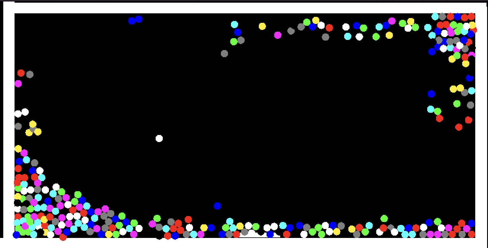
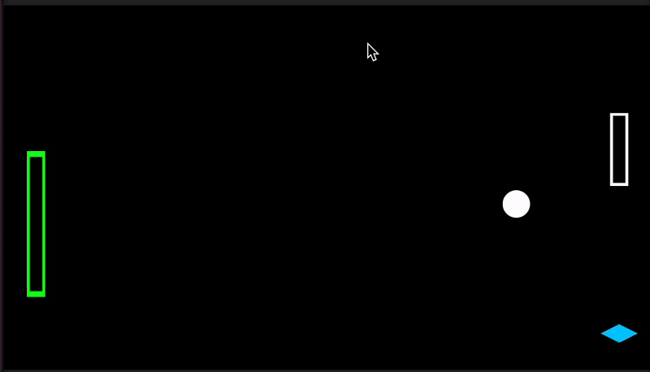
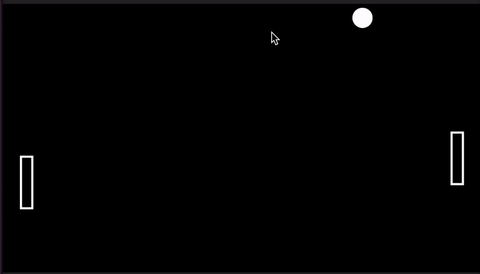
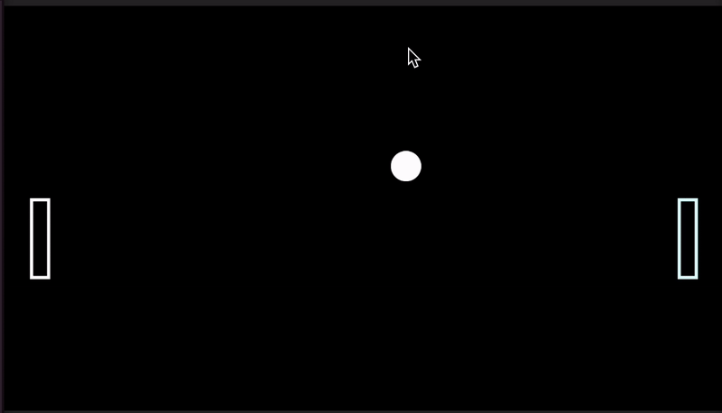
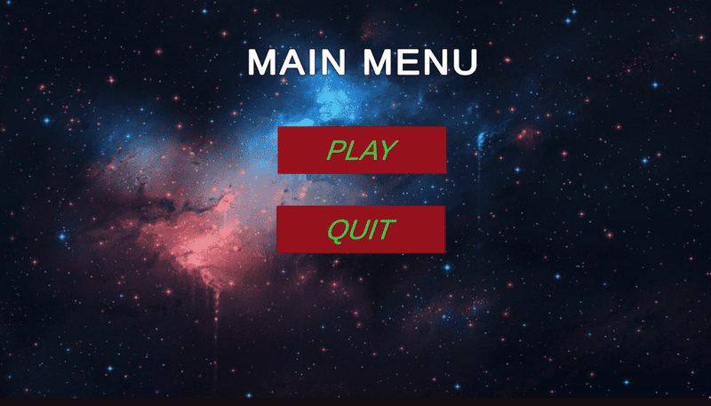
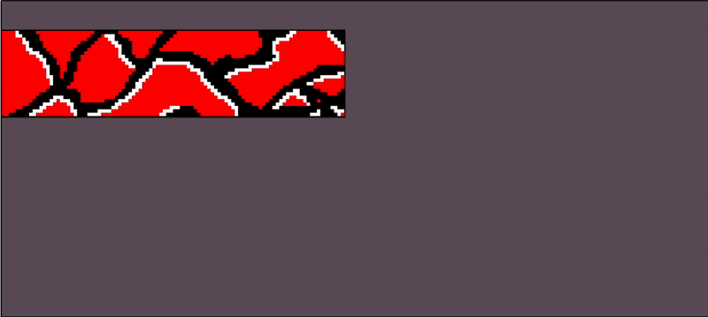
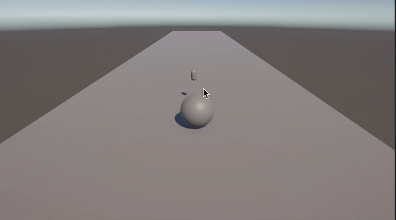

# Process Journal
## Tiny Game | 01.23.25
Welcome to my design journal… I don’t really know what 
I’ll be writing here and how but I am writing this 
before creating my first tiny game on Jan 17th. I want 
to put a lot of effort into this class and come out 
with stuff I am happy with and learn lots and lots.

Okay so before actually making the game I have many 
thoughts and ideas. I haven’t looked at the engines yet 
however I want to make a fun quick game that is a 
little challenging platformer type game. Not really 
sure what I am going to do but going to jump right into 
it now.

Back now from making it that was lots of fun. I made 5 
levels that are “pretty difficult” and it’s just a 
simple start at one point get to the end point. I used 
a tool called PocketPlatformer and it was very good. I 
wanted to make a game that was challenging and quick. I 
was very confused at first then it started to flow and 
next I know I was making level after level. I tried to 
use most of the components in the tool (sprites, 
mechanics, etc.) because I thought it would be cool to 
use everything. I also added optional coins on each 
level because I like that aspect of most games its 
interesting to me since it isn’t mandatory and adds a 
challenge to every level.

Here is the game: [Tiny Game Project](../Projects/TinyPlatformer.html).

Here are the 
levels if you 
want to take a look before playing (they 
are pretty simple start at red get to green):

 

I had lots of fun doing this and kinda accomplished what I wanted to. I’m very excited to continue and use Unity and make something with more depth and on my own. The tool was very simple and easy to use and just allowed me to do the platformer I wanted.

After playtesting played some fun games and my favorite was the puzzle game by Ryan very simple and easy to pick up. Very good implementation. My game was a hit however it was just people trying to beat it because it was really difficult so it became a mini challenge for everyone.

## Explosion/Stacker Game | 01.29.25
Starting off I want to make a game where something gets 
stacked and the whole point is to stack a tower as high 
as possible. I keep thinking of a game where you're 
stacking burger toppings and condiments and trying to 
make the burger as tall as possible without making it 
tip over. So that's what I'll try. Lets go!

Okay so I changed my thought process completely. I was 
playing around with collisions and the physics behind 
Unity. So I found a way to make objects static and 
dynamic based on an inputs or collision. So what I did 
was made it so when the platform touches any of the 
balls they go static and get stuck to the platform. I then 
created a box around so if they went passed they get 
destroyed.

I then was wondering how to make it interesting so I 
looked up how to affect a force onto objects. I then 
attached that to the platform and add a key input so on 
space bar they would get affected. When I added this 
they would just become elongated and still don't move 
because they were still stuck to the platform.

To beat this I made it no longer "stick" but just freeze 
on spot. Basically just removed the collision box on 
them and just had it pause. However, the circles still 
bounce between each other which I liked. I also wanted it 
to be relaxing/look cool, so I changed the colors as they 
dropped by just randomizing which ones are selected in 
an array.

It's more of an experience and not a game, but I think it 
came out nicely where you just let the balls generate 
and then bounce them around. I added movement in the up 
and down direction so you can go freeze them and have 
control to where they bounce. Furthermore, I added a box 
that they collide off of.

So a proper explanation of what I did was:

1. Tried to make a game where objects stacked on each 
   other and goal is to make it as high as possible
2. Found a way to make the objects "stuck" when 
   collision occured
3. Instead of stacking objects, played around with a 
   "force" concept that is triggered with space bar
4. Added a box so all the circles would contain in the 
   play area and added WASD movement
5. Made it so any object touched by the platform gets 
   frozen then can be re-animated by the "force" 
   mechanic which causes a fun experience (I think). 

Here is what it looks like:

Here is the game: [ExplodeGame](../Projects/StackerGame)

Overall this was a fun experience and I had a great time 
figuring out what I could accomplish and make something 
fun. I'm glad I got to play around with collisions, the 
physics engine, and static/dynamic sprites. My thoughts 
if I had more time to continue this game would be to add 
a little "cup" that would collect the balls and score 
points if the player landed the balls inside. Would be 
cool if we could expand on these games!

I want to try EzGif for the games !reminder!

## PowerPong | 02.06.25

Note add power-ups so that it would be cool and GIFs

Okay coming out of class with no real idea of what I 
want to do. I think I want to put power-ups in the game 
that have different triggers. I want to make a solid 
three of them and make them generate randomly and be 
collected by the paddle not the ball since I do not know 
how to assign who would get it.

So main three power-ups:
1. Freeze: Freeze the opponent paddle. ~3s
2. BigPaddle: Turn your own paddle big so that it covers 
   more space. ~10s
3. FastBall: Increase the speed of the ball. ~3s

To implement these sounds I think I'll have to create 
three sprites set them as prefabs and generate them 
around the Scene so that OnColission they will trigger 
whatever they need to trigger. That's my thought process 
just create them and spawn them arround and once the 
paddle comes into contact... bam trigger whatever I want 
to accomplish. I am going to go test and I'll come back 
and write out what happened.

Okay! Done. I got to complete the game in one shot and 
it was not too bad at all. I'll go through each power-up 
and showcase what they do and how I managed to implement 
them.
#### 1. Freeze Power-up
For the freeze power-up I had some difficulty freezing 
the opponents paddle (not the one acquiring it). So what 
I did to get around this was to check which paddle (left 
or right) was coming into contact with the object then I 
changed the speed in the "opponent's" script to 0. I 
also had to store the paddle speed prior to this to set 
it back after the timer of 3 seconds was done.
 
#### 2. BigPaddle Power-up
So I started by saving the original size before the 
power-up triggers so I could revert back once the it 
ended. Then what I pretty much did was increase the 
scale (in the y axis) by 1 whenever the paddle came into 
contact with it. Then after 10 seconds it reverts back 
to the original scale. Pretty simple and easy since it 
just affects the paddle that is touching the power-up.
 
#### 3. FastBall Power-up
Fastball was the easiest of the three power-ups since 
all I really had to do was create a function on the ball 
script that increased the speed of the ball object and 
multiply it with the force. Also had to revert to the 
original speed and to do so I just divided it by the same 
amount applied.
 

For all the power-ups I made them change the color of 
the paddles and gave them each their own color. 

Red = FastBall
 Blue = Freeze
 Green = BigPaddle

So thats pretty much it I got my power-ups added and 
they work pretty seamlessly. Generating them was pretty 
easy. I decided to put specific spawn areas for them in 
the corners and set it so it would random pick one of 
the spawn areas. 

## SomeBrickBreakerGame | 02.13.25

Up until now I haven't really played with sprites, 
animations or any visual aspects of the game at all. I 
think this time I am going to try and focus on doing 
that. So a menu screen, animation for the bricks 
breaking, sprite for the ball and paddle that look goofy 
maybe something more...

We'll see I don't have much time this week a lot going 
on but if I can learn a little about sprites that would 
be nice. I want to do sprites since all I've focused on 
until now is all game components and mechanics. Starting 
now.

Okay so I managed to add a function menu, some sprites 
to the ball and paddle, and an animation for the balls 
breaking. The animation part was a little tricky and had 
some road blocks and it came out a little wonky but it 
came out working so thats cool.

Here is the menu:
 

Pretty simple just play and quit buttons but its 
functional and I did not know how to do this prior. I 
had to create buttons and background which was new. I 
also learnt how to switch scenes based on index so you 
can randomly pick scenes (if you need that maybe I'll 
try it in a later project). The hover aspect over the 
buttons is cool too and I learnt about importing fonts 
as well even though I did not implement it.

Next the animation.

This is what I made using libresprite (thanks Sam):
 

After making this animation I thought it would look like 
how it is in libresprite but for some reason it did not. 
In Unity, it removed all the white and when there were 
gaps (the transparent parts on later frames) everything 
just disappeared. I think Unity does not let an object 
have empty space. I'm not sure. But the white being gone 
kinda upset me. Whatever...

Adding the animation took some time but in the end I got 
there. I had to create a folder of 12+ sprites so that 
the animation lasted 12 frames long and then played each 
sprite/frame. It was also cool learning about the 
animation controller which allows you to switch and do 
different things. For example, the bricks by default are 
in an "Idle" state and then once the "Break" triggers 
(this is when the ball collides with the brick) it then 
enters the "Animation" state and plays the animation I 
set it to. Very sweet and I'll definitely be using this in 
the future for other games.

Here's how it turned out in Unity with the extra sprites 
for the ball and paddle:
 

Not terrible not great. I learnt a lot about sprites, 
animations and scenes this week which was nice. Happy 
with what I did, a little annoyed about the animation 
part but overall proud that I accomplished what I wanted 
to in the end (with some minor mistakes).

## 3DGame | 02.20.25

I really did not want to continue doing the brickbreaker 
game I don't know why. I wanted to try something new 
this week entirely. Been thinking about the games I 
usually play and what I like and it is mainly 3D shooter 
games so maybe I'll start on that (just something simple)
. So I thought of a camera that follows the player, a 
camera hovering over the player (so third-person) and 
maybe a shootable gun would be cool. So lets begin!

#### Player Controls
So starting with the controls... I did not know there 
was a "new" version of Unity input controls. Interesting 
so I gave it a chance and almost had it working but just 
could not get it to function properly. I had it all 
implemented properly it just would not see my move 
function in my script sooo maybe at a later time I'll 
try and fix it. I went with the classic inputs = 
movement and got it to work pretty seemlessly with a 
sphere on a little platform I made. NICE.

#### Camera 
Getting the camera to attach to the player was actually 
a lot easier than I thought. It now follows the player 
and never goes to far away which is cool. I had to play 
around with the angles a bunch to make something that I 
liked and didn't look to choppy. But basically I just 
set it to always look at my "player" model and it 
follows it!

#### Gun/Bullets
So doing this was a little harder because I needed not 
only the gun and bullets but also where the bullets came 
out from. Following a tutorial I was able to get it done 
but at first it would shoot out from the inside of the 
character because I had set the "end" of the gun inside 
the player model. Once I had set it out I kept playing 
around with its position until it looked like the player 
was shooting it out from the front. And it follows the 
player around as well so it moves as the player moves. 
It shoots these little capsules that also have physics 
so they roll for awhile until they get destroyed after a 
certain amount of time it's really funny. They also 
bounce of objects and stuff and I want to try and make 
it launch things in the future. But for now I was proud 
with what I accomplished. 

Here's a little demo:
 

So as you can see the camera follows the "player" 
(sphere) around forward, back, left, right. And when you 
click you shoot out these little pills that bounce 
around and just launch forward. A little janky but I'm 
happy with it and I definitely want to keep working on 
it and maybe have incoming enemies that you have to 
launch away or something like that. It was not that 
difficult implementing everything since it was all 
pretty simple concepts and used a lot of the same 
physics, prefab and movement ideas we learnt doing 2D 
games but I'm glad I got a little 3D game going.

## Extra Credit | 03.06.25

My game of choice for a deeper analysis is the valve game Left 4 Dead 2. As a classic multiplayer zombie shooter this game seems simple at first but gets more complicated as you look at the nuances and detail that was put in the game by the developers. There are countless examples of this in the game, but I will focus on a few key aspects in this analysis.

To begin with, the game is played in a team of 4 in coop or two teams of 4 in versus. It is played as a linear game where the “survivor” team must go from point A to B while facing off zombies. In versus mode the “infected” team must work together to stop the opposing survivor team from making it to the safe room. At all points of this game teamwork is a central aspect. Despite the name Left 4 Dead, rushing ahead or going solo will get you killed since special infected can grab/pin you down and the only way to escape is to be freed by a teammate.

Now although at a glance it seems like a simple game, the developers make the game constantly dynamic and changing so it never gets stale. They do this by implementing what they call “The Director”. This director is a game modifier that changes how the map plays out, where zombies spawn, what items are found, and how difficult the level is. To put it simply; the better you are doing the harder the game gets. This makes the game always different each time you play it. The zombies never come from the same area, the maps never feel the same and even players (including myself) who have played the game extensively, don’t feel like that it gets repetitive.

As I mentioned before, the main component of the game is the coop aspect. I love how it is a central part of the game. Without it you get overwhelmed very quickly and lose. Same with the “infected” team in the versus mode. If you don’t work as a team and coordinate attacks the survivors are going to run past without a scratch. It makes the game competitive and balanced since both teams get to play as survivors and infected in the same round to see who makes it the furthest.

Personally, I have more than a thousand hours in this game and have played it competitively against professionals and that is another aspect in which I enjoy. The mechanics: shooting, movement, teamplay, map knowledge, etc. are all down in an outstanding way and although this game is 16 years old it still outperforms many triple A games in its category.

I think the replayability and the coop aspect of the game are its strong suits and they are definitely things I want to borrow when making games in the future. Nowadays games get boring quick since they get repetitive and if I could I would want to create something that feels unique after each playthrough similarly to L4D2.

## Iterative Prototype Game | 03.06.25

Starting off with the in class activity to brainstorm game ideas:

TOWER DEFENCE BRAINSTORMING LIST

Towers, monsters
Defence, attack
Fence?
Gold, resources, managing people to work
defending the castle,
paths, pathing, walk, run, fly, dig?
Shooting, spells, summoning units
Necromancers, plants vs zombies, the disco guy
placing buildings
building types: magic, physical, unit summoning,
stick man tower defence
pvp tower defence where you summon units to fight each other
archers, miners, barbarians,
coop tower defence
BTD monkeys and balloons
pop
spell casting
I really like necromancy characters do this please
Back to towers: stone, wood, gold, materials
age games
Age of Empires so aging up
going from like cavemen -> renaissance -> modern idk
rogue like tower defence game?
how would that work
maybe your build phase is going through a dungeon in a certain amount of time making it back then having to build
if you don’t make it back like maze runner issue
you’re trapped really hard to survive
Maze?
maze tower defence game.
What are we defending?
A base
Castle?
defending organs
tower defence but its anatomy based
so fighting diseases with like red/white blood cells
gather water and sleep to build immune system lol
lowkey some good ideas here
maybe defending the hive
OH OH
I like the idea of reverse tower defence
so instead of defending you have to attack a “base” that either is generated or someone else built
Like PVZ when u play as the zombies is so cool

IDEAS
-	PVP tower defence where you summon units to fight against each other
-	Rogue like tower defence game
-	Zombie tower defence game where you are the zombies and have to beat premade base
-	Disease tower defence game
-	Hive game? Hive mind?
-	Necromancer summoning zombies to defend castle
-	Maze runner dungeon to gather resources then build eventually walls drop?

SPEED DATING
-	Make a room to defend treasure
-	Target/Archer game with phones one person is target one is bow

-	Using electricity and metal to shock things back to life
-	Western where you manipulate each other to either pulling the trigger too fast or playing with someone’s head
-	Cleaning a hedge maze for a king
-	Bee espionage “ESBEENAGE”
-	Gold horse amour

-	Stealth game to use loud sounds (turning on stuff) to mask what you’re doing
-	Begging game for smokes
-	SoundScape (city/buildings making sounds)
-	Using drugs as a resource to survive

CONSTRAINT
-	What if the game only took 1-2 minutes?

Okay so my goal here is to make a quick tower defence game (maybe even 1v1) where you are limited by time to 
gather resources to defend your base or attack the enemy base. Not sure how this will plan out but I will go with it.

